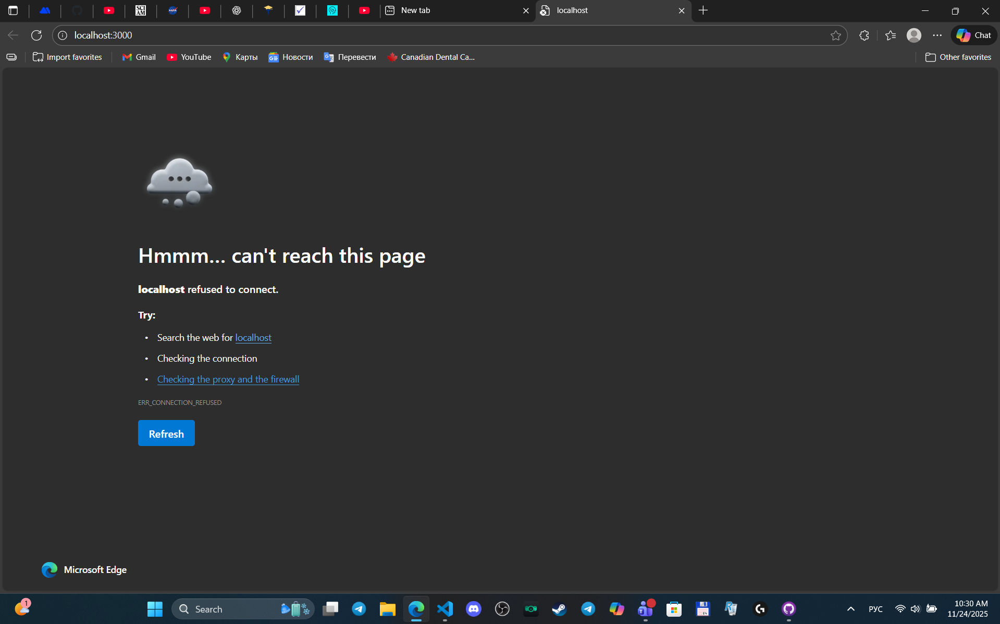
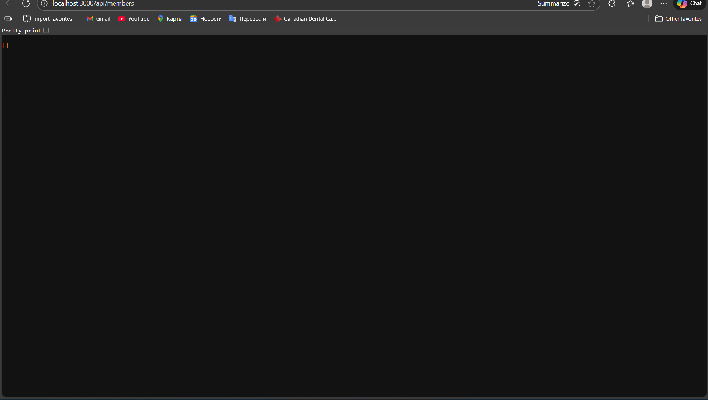
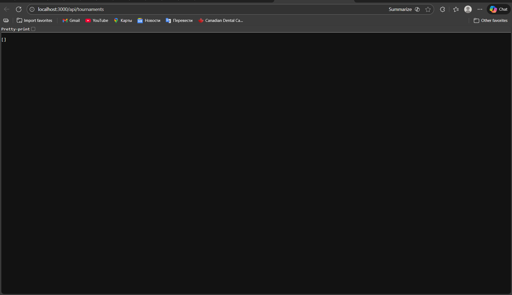
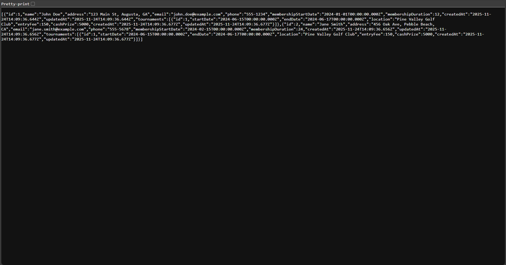
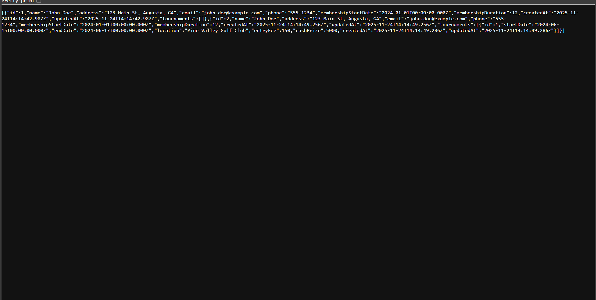
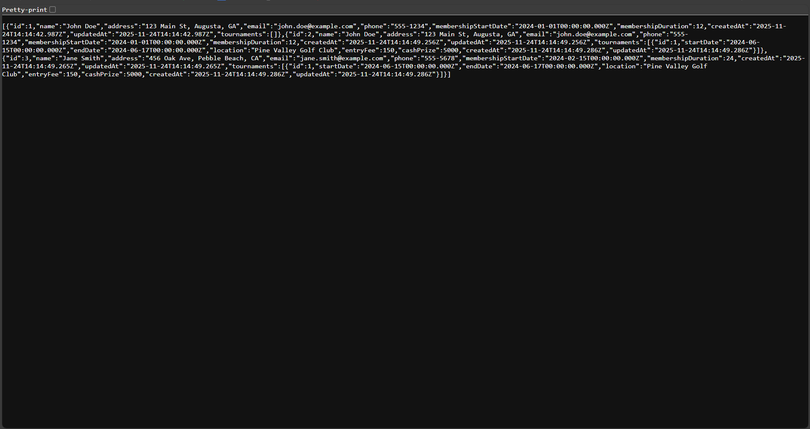
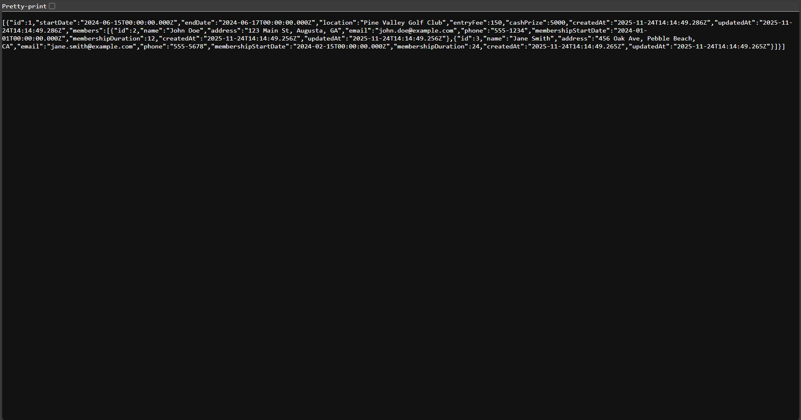
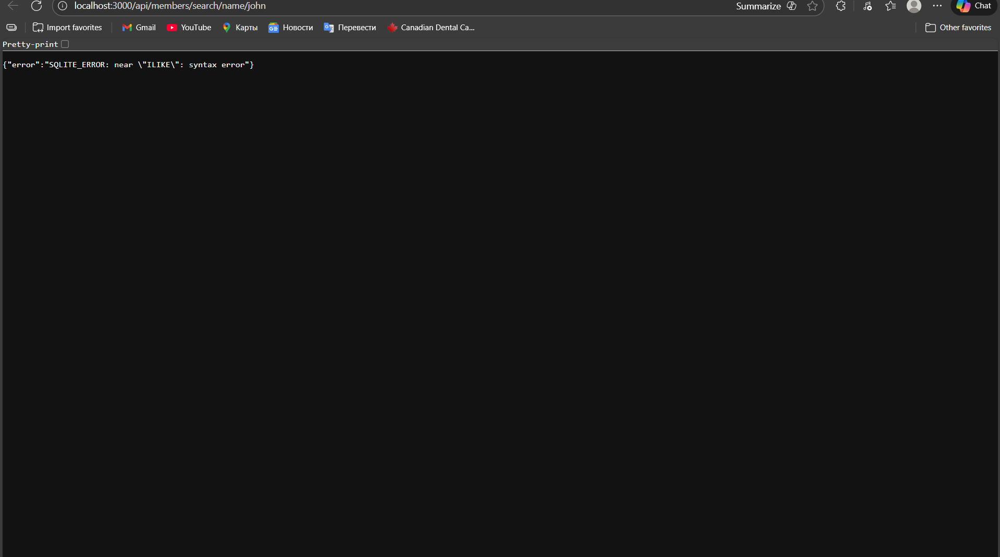
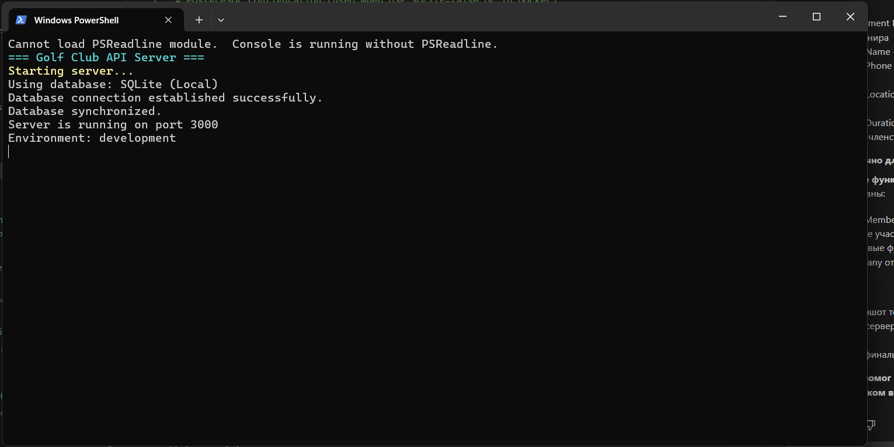

# Golf Club Tournament Management API

A RESTful API for managing golf club members and tournaments with Docker support and AWS RDS integration.

## 📚 Documentation

- **[QUICKSTART.md](./QUICKSTART.md)** - Get started in 5 minutes
- **[TESTING_GUIDE.md](./TESTING_GUIDE.md)** - Comprehensive testing guide with sample data
- **[AWS_RDS_SETUP.md](./AWS_RDS_SETUP.md)** - AWS RDS deployment instructions
- **[ARCHITECTURE.md](./ARCHITECTURE.md)** - System architecture and diagrams
- **[PROJECT_SUMMARY.md](./PROJECT_SUMMARY.md)** - Complete project overview
- **[SUBMISSION_CHECKLIST.md](./SUBMISSION_CHECKLIST.md)** - QAP submission checklist

## Features

- **Member Management**: Create, read, update, delete golf club members
- **Tournament Management**: Create, read, update, delete tournaments
- **Member-Tournament Association**: Add members to tournaments
- **Advanced Search**: Search by various criteria (name, phone, location, dates)
- **Docker Support**: Easy deployment with Docker and Docker Compose
- **AWS RDS Ready**: Configured for AWS RDS PostgreSQL database
- **ORM with Sequelize**: Type-safe database operations

## Tech Stack

- **Runtime**: Node.js 18+
- **Framework**: Express.js
- **ORM**: Sequelize
- **Database**: PostgreSQL 15
- **Containerization**: Docker & Docker Compose

## Prerequisites

- Node.js 18+ (for local development)
- Docker & Docker Compose (for containerized deployment)
- PostgreSQL 15+ (for local development without Docker)

## Installation

### Option 1: Running with Docker (Recommended)

1. **Clone the repository**
```bash
git clone https://github.com/alexnotb/QAP-4---SDAT-DEV-OPS-COMBINED.git
cd QAP-4---SDAT-DEV-OPS-COMBINED
```

2. **Create environment file**
```bash
cp .env.example .env
```

3. **Start with Docker Compose**
```bash
docker-compose up --build
```

The API will be available at `http://localhost:3000`

The PostgreSQL database will be available at `localhost:5432`

4. **Stop the containers**
```bash
docker-compose down
```

5. **Stop and remove volumes (clears database)**
```bash
docker-compose down -v
```

### Option 2: Local Development

1. **Clone the repository**
```bash
git clone https://github.com/alexnotb/QAP-4---SDAT-DEV-OPS-COMBINED.git
cd QAP-4---SDAT-DEV-OPS-COMBINED
```

2. **Install dependencies**
```bash
npm install
```

3. **Set up PostgreSQL database**
```bash
# Create database
createdb golf_club_db
```

4. **Configure environment variables**
```bash
cp .env.example .env
# Edit .env with your local database credentials
```

5. **Start the server**
```bash
npm start
# or for development with auto-reload
npm run dev
```

## API Endpoints

### Members

#### Create Member
```http
POST /api/members
Content-Type: application/json

{
  "name": "John Doe",
  "address": "123 Main St, City, State",
  "email": "john.doe@example.com",
  "phone": "555-1234",
  "membershipStartDate": "2024-01-01",
  "membershipDuration": 12
}
```

#### Get All Members
```http
GET /api/members
```

#### Get Member by ID
```http
GET /api/members/:id
```

#### Update Member
```http
PUT /api/members/:id
Content-Type: application/json

{
  "name": "John Smith",
  "phone": "555-5678"
}
```

#### Delete Member
```http
DELETE /api/members/:id
```

#### Search Members by Name
```http
GET /api/members/search/name/:name
Example: GET /api/members/search/name/john
```

#### Search Members by Phone
```http
GET /api/members/search/phone/:phone
Example: GET /api/members/search/phone/555
```

#### Search Members by Membership Duration
```http
GET /api/members/search/duration/:duration
Example: GET /api/members/search/duration/12
```

#### Search Members by Tournament Start Date
```http
GET /api/members/search/tournament-date/:date
Example: GET /api/members/search/tournament-date/2024-06-01
```

### Tournaments

#### Create Tournament
```http
POST /api/tournaments
Content-Type: application/json

{
  "startDate": "2024-06-15",
  "endDate": "2024-06-17",
  "location": "Pine Valley Golf Club",
  "entryFee": 150.00,
  "cashPrize": 5000.00
}
```

#### Get All Tournaments
```http
GET /api/tournaments
```

#### Get Tournament by ID
```http
GET /api/tournaments/:id
```

#### Update Tournament
```http
PUT /api/tournaments/:id
Content-Type: application/json

{
  "location": "Augusta National Golf Club",
  "cashPrize": 10000.00
}
```

#### Delete Tournament
```http
DELETE /api/tournaments/:id
```

#### Add Member to Tournament
```http
POST /api/tournaments/:tournamentId/members/:memberId
```

#### Get All Members in Tournament
```http
GET /api/tournaments/:id/members
```

#### Search Tournaments by Start Date
```http
GET /api/tournaments/search/start-date/:date
Example: GET /api/tournaments/search/start-date/2024-06-01
```

#### Search Tournaments by Location
```http
GET /api/tournaments/search/location/:location
Example: GET /api/tournaments/search/location/valley
```

## Docker Configuration

### Dockerfile
The application uses a multi-stage Node.js 18 Alpine image for optimal size and security.

### Docker Compose Services

1. **postgres**: PostgreSQL 15 database
   - Port: 5432
   - Volume: Persistent data storage
   - Health checks enabled

2. **api**: Node.js application
   - Port: 3000
   - Depends on postgres service
   - Auto-restart on failure

### Docker Commands

```bash
# Build and start containers
docker-compose up --build

# Run in detached mode
docker-compose up -d

# View logs
docker-compose logs -f

# Stop containers
docker-compose down

# Remove volumes (clear database)
docker-compose down -v

# Rebuild specific service
docker-compose up --build api
```

## AWS RDS Integration

### Setting Up AWS RDS

1. **Create RDS Instance**
   - Engine: PostgreSQL 15.x
   - Instance: db.t3.micro (free tier eligible)
   - Storage: 20GB SSD
   - Public accessibility: Yes
   - Database name: golf_club_db

2. **Configure Security Group**
   - Add inbound rule for PostgreSQL (port 5432)
   - Source: Your IP or application IP

3. **Update Environment Variables**
```env
DB_HOST=your-instance.region.rds.amazonaws.com
DB_PORT=5432
DB_NAME=golf_club_db
DB_USER=postgres
DB_PASSWORD=your-secure-password
NODE_ENV=production
```

### Connecting to RDS

The application automatically connects to the database specified in environment variables. No code changes needed - just update `.env` file.

### Testing RDS Connection

```bash
psql -h your-instance.region.rds.amazonaws.com -U postgres -d golf_club_db
```

### Common RDS Issues

**Connection Timeout**
- Check security group inbound rules
- Verify public accessibility is enabled
- Ensure RDS instance is in available state

**Authentication Failed**
- Verify username and password
- Check master user credentials in RDS console

**Cannot Resolve Host**
- Verify endpoint URL is correct
- Check VPC DNS settings

See [AWS_RDS_SETUP.md](./AWS_RDS_SETUP.md) for detailed deployment guide.

## Database Schema

### Members Table
- `id`: Integer (Primary Key, Auto-increment)
- `name`: String (Required)
- `address`: String (Required)
- `email`: String (Required, Email format)
- `phone`: String (Required)
- `membershipStartDate`: Date (Required)
- `membershipDuration`: Integer (Required, months)
- `createdAt`: Timestamp
- `updatedAt`: Timestamp

### Tournaments Table
- `id`: Integer (Primary Key, Auto-increment)
- `startDate`: Date (Required)
- `endDate`: Date (Required, must be after startDate)
- `location`: String (Required)
- `entryFee`: Decimal(10,2) (Required)
- `cashPrize`: Decimal(10,2) (Required)
- `createdAt`: Timestamp
- `updatedAt`: Timestamp

### Tournament_Members Table (Junction)
- `id`: Integer (Primary Key, Auto-increment)
- `memberId`: Integer (Foreign Key)
- `tournamentId`: Integer (Foreign Key)
- `createdAt`: Timestamp
- `updatedAt`: Timestamp

## Environment Variables

```env
# Database Configuration
DB_HOST=localhost          # Use RDS endpoint for production
DB_PORT=5432
DB_NAME=golf_club_db
DB_USER=postgres
DB_PASSWORD=postgres       # Use strong password for production

# Server Configuration
PORT=3000
NODE_ENV=development       # Use 'production' for deployment
```

## Testing with Postman

1. Import the API endpoints into Postman
2. Create a new environment with base URL: `http://localhost:3000`
3. Test the following workflow:
   - Create members
   - Create tournaments
   - Add members to tournaments
   - Search members and tournaments
   - Retrieve tournament participants

Sample test screenshots should include:
- Creating members
- Creating tournaments
- Adding members to tournaments
- Search operations
- Getting all members in a tournament

## Project Structure

```
.
├── src/
│   ├── config/
│   │   └── database.js       # Sequelize configuration
│   ├── models/
│   │   ├── Member.js         # Member model
│   │   ├── Tournament.js     # Tournament model
│   │   └── index.js          # Model associations
│   ├── routes/
│   │   ├── members.js        # Member endpoints
│   │   └── tournaments.js    # Tournament endpoints
│   └── index.js              # Application entry point
├── .env.example              # Environment template
├── .gitignore
├── .dockerignore
├── Dockerfile                # Docker image configuration
├── docker-compose.yml        # Multi-container setup
├── package.json
├── AWS_RDS_SETUP.md         # AWS deployment guide
└── README.md
```

## Development Notes

### Issues Encountered

1. **Docker Networking**: Resolved by using service names in docker-compose
2. **Database Sync**: Implemented health checks for proper startup order
3. **RDS Connection**: Security group configuration is critical

### Future Enhancements

- Add authentication/authorization
- Implement pagination for list endpoints
- Add input validation middleware
- Implement tournament scoring system
- Add email notifications for tournament updates

## GitHub Actions (Optional)

A GitHub Actions workflow is included to automatically build and push Docker images to Docker Hub when merging to master.

See [.github/workflows/docker-publish.yml](.github/workflows/docker-publish.yml)

Required GitHub Secrets:
- `DOCKERHUB_USERNAME`
- `DOCKERHUB_TOKEN`

## License

ISC

## Author

Alex - QAP 4 SDAT DevOps Assessment

## Testing Screenshots

All testing screenshots are located in the `screenshots/` folder.

### 1. API Health Check

- **Endpoint**: `GET /api/health`
- **Shows**: API version and available endpoints

### 2. Get All Members

- **Endpoint**: `GET /api/members`
- **Shows**: List of all golf club members with their tournaments

### 3. Get All Tournaments

- **Endpoint**: `GET /api/tournaments`
- **Shows**: List of all tournaments with participating members

### 4. Get Member Details

- **Endpoint**: `GET /api/members/1`
- **Shows**: Complete member information including tournaments

### 5. Get Tournament Members

- **Endpoint**: `GET /api/tournaments/1/members`
- **Shows**: All participants in a specific tournament

### 6. Search Members by Name

- **Endpoint**: `GET /api/members/search/name/john`
- **Shows**: Members matching the search term

### 7. Search Members by Phone

- **Endpoint**: `GET /api/members/search/phone/555`
- **Shows**: Members with matching phone numbers

### 8. Search Tournaments by Location

- **Endpoint**: `GET /api/tournaments/search/location/valley`
- **Shows**: Tournaments at matching locations

### 9. Search Members by Duration

- **Endpoint**: `GET /api/members/search/duration/12`
- **Shows**: Members with specified membership duration

### 10. Server Running

- **Shows**: Terminal with server startup messages and database connection

### Screenshot Requirements Met
- ✅ Complete CRUD operations for Members and Tournaments
- ✅ Many-to-many relationships (members in tournaments)
- ✅ All 6 required search functions
- ✅ Proper JSON responses with related data
- ✅ Server running successfully

## Submission Checklist

- [x] GitHub repository with complete code
- [x] Postman testing screenshots (10 screenshots captured)
- [x] Docker running screenshot (server terminal)
- [x] AWS RDS setup screenshots (documentation provided)
- [x] Comprehensive README
- [x] AWS deployment documentation
- [x] Optional: GitHub Actions workflow
